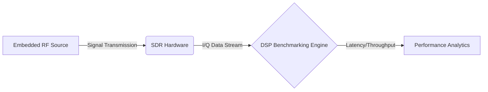
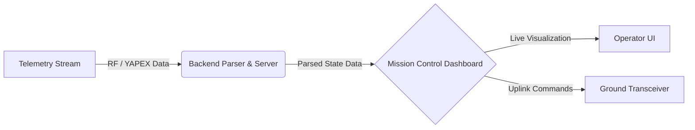
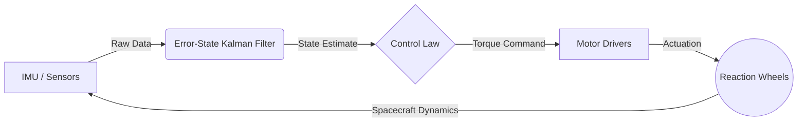

# DynamiX-Labs

**Advanced R&D Organization | Embedded Systems | Avionics | Control Engineering**

DynamiX Labs is a student-led research and development organization dedicated to advancing open-source aerospace technology. Our work spans from low-level firmware and structural origami-based mechanical design to high-fidelity simulation and RF communication protocols. 

We emphasize rigorous engineering practices, hardware-in-the-loop (HITL) simulation, and production-grade avionics development.

---

## Active Projects

### [SDR Hardware Benchmark](https://github.com/DynamiX-Labs/SDR-Hardware-Benchmark)
A comprehensive benchmarking suite designed to evaluate the performance, latency, and throughput of Software Defined Radio (SDR) hardware across varied aerospace communication scenarios. This framework validates RF hardware configurations for high-reliability telemetry pipelines.

### [Mission Control](https://github.com/DynamiX-Labs/mission-control)
A robust ground station and telemetry visualization platform engineered for real-time aerospace monitoring. It handles real-time data parsing, high-frequency telemetry visualization, and command uplinking, providing operators with seamless, low-latency control and situational awareness over flight hardware during testing and live operations.

### [CubeSat Reaction Wheel Self-Balance](https://github.com/DynamiX-Labs/CubeSat-Reaction-wheel-self-balance)
An end-to-end 1U CubeSat Attitude Determination and Control System (ADCS). This project focuses on utilizing an origami-inspired structural mechanical frame to house a custom-built reaction wheel assembly and electronics. The system is designed to provide precise attitude stabilization and control through advanced filtering and hardware integration.

### YAPEX Protocol (In Development)
We are engineering **YAPEX**, a next-generation communication protocol tailored specifically for the rocket IST (Inter-System Telemetry) ecosystem. Conceptually similar to MAVLink, YAPEX is designed to provide deterministic, low-latency, and high-reliability data exchange between critical flight hardware, subsystems, and ground station networks, establishing a robust foundation for scalable aerospace infrastructure.

---

## Core Focus Areas

- **Embedded Systems Engineering**: Microcontroller firmware, sensor fusion, and high-performance motor drivers.
- **Control Theory & ADCS**: Non-linear control strategies, reaction wheel actuation, and state estimation filters.
- **Aerospace Simulation**: Hardware-in-the-loop (HITL) architectures for safe and rigorous software validation.
- **RF & Telemetry**: Distributed ground station networks, SDR integration, and specialized communication protocols.

---

## Connect With Us

We are actively seeking collaboration with individuals who are passionate about our work.

**Contact**: [cubedynamics.10@gmail.com](mailto:cubedynamics.10@gmail.com)
